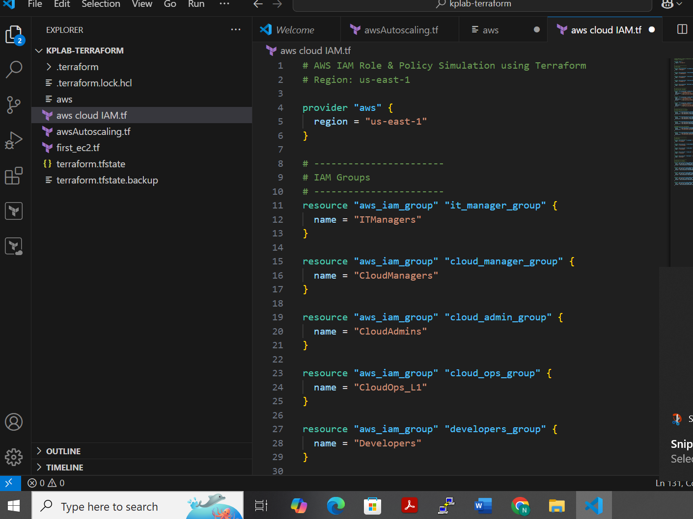
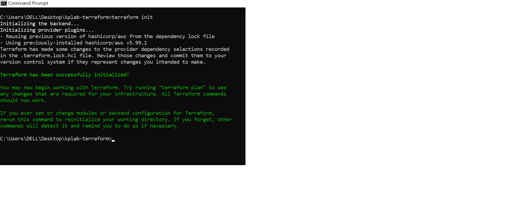
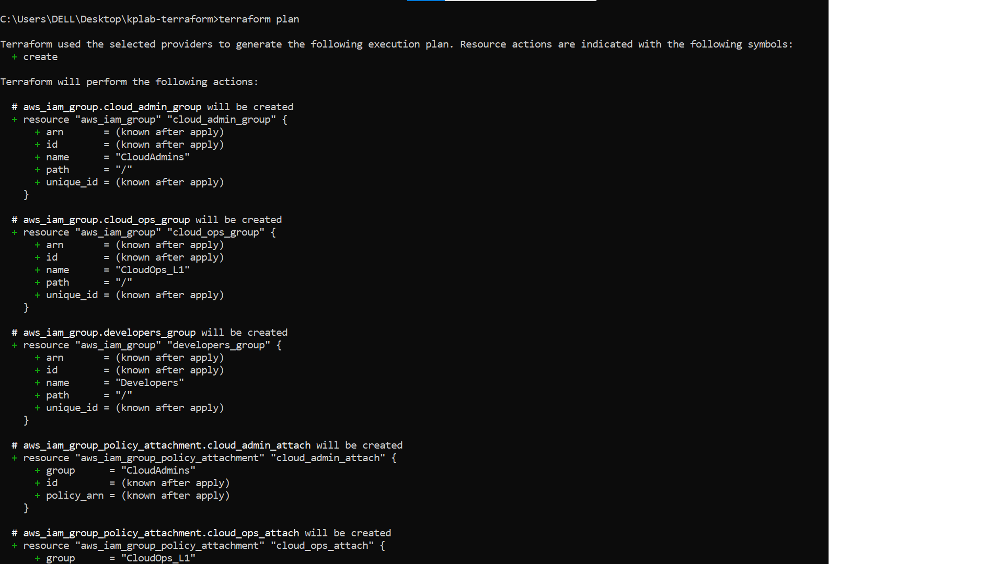
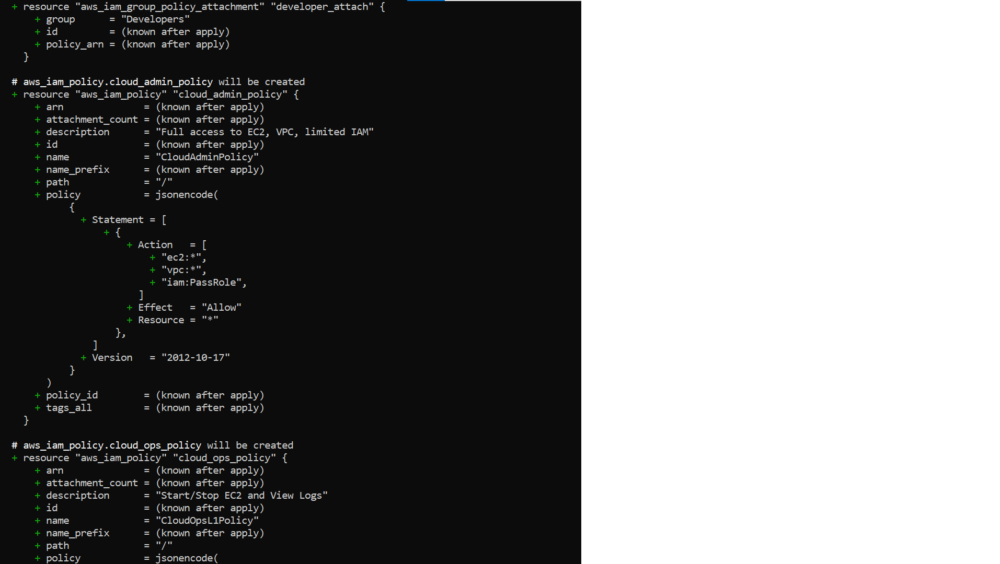
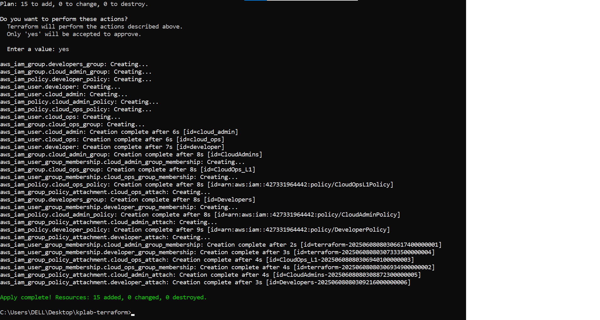
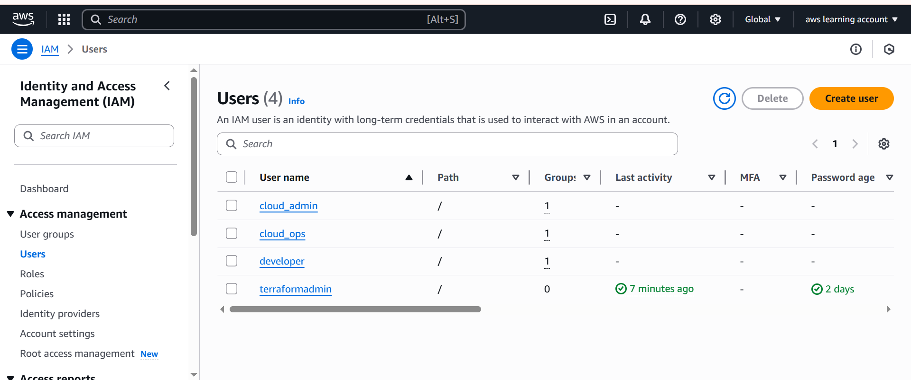
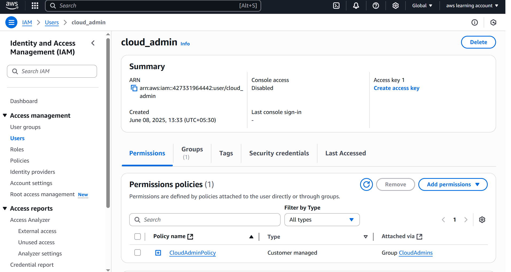
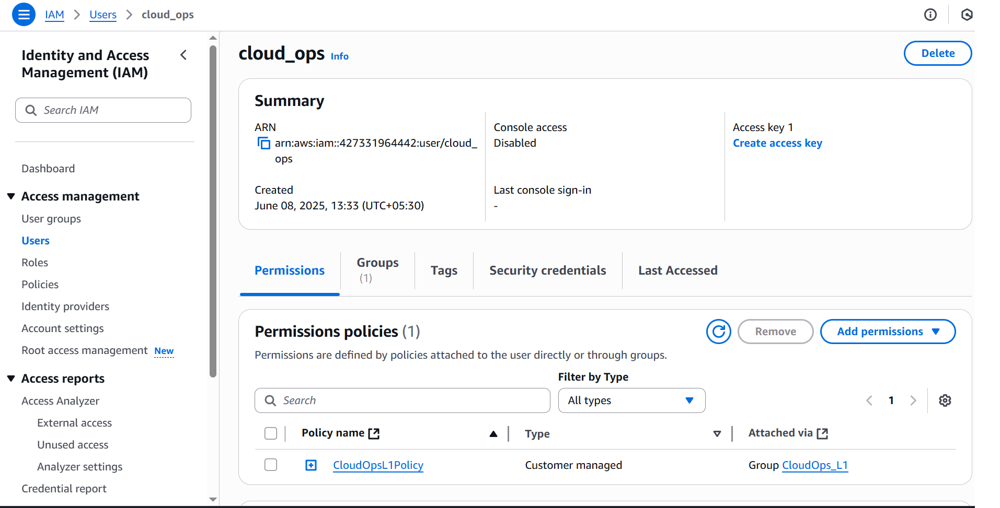

#  Terraform AWS IAM Users, Groups, and Policies

This project uses **Terraform** to create and manage **IAM users, groups, and policies** in AWS. It showcases how to implement a basic **role-based access control (RBAC)** setup using only IaC (Infrastructure as Code).

---

###   What This Code Does

### 1. **Creates IAM Groups**
- `CloudOps_L1`
- `CloudAdmins`
- `Developers`

### 2. **Creates IAM Users**
- `cloud_ops`
- `cloud_admin`
- `developer`

### 3. **Assigns Users to Groups**
- Each user is associated with their respective group using `aws_iam_user_group_membership`.

### 4. **Defines Custom IAM Policies**
Policies are defined inline using `jsonencode()` in Terraform:

- `CloudOpsL1Policy`  
  ➤ Allows: Start/Stop EC2, Describe Logs, Describe EC2 Instances

- `CloudAdminPolicy`  
  ➤ Allows: Full EC2 & VPC Access, IAM PassRole

- `DeveloperPolicy`  
  ➤ Allows: S3 Get/Put, EC2 Describe, CodeDeploy full access

### 5. **Attaches Policies to Groups**
- Each policy is attached to its corresponding IAM group using `aws_iam_group_policy_attachment`.

---

## Below are the IAC code execute via command steps & its result

# IAC IAM user code in VS Code  

## Terraform Init command    

## Terraform Plan command   
  

## Terraform Apply command    
  

## Terraform Apply Result    

## Final Result on IAM Dashboard (Users)  
  
  
  

